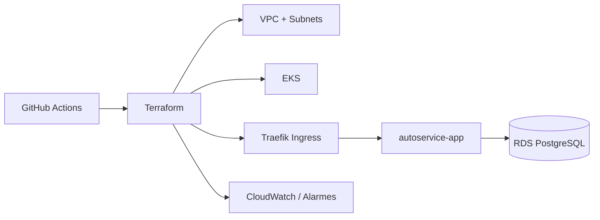

# Autoservice Infra K8s

Infraestrutura Kubernetes do Tech Challenge, com foco em AWS, EKS, VPC, autoscaling, gateway de entrada e observabilidade.

## O que este repositório entrega

- VPC com subnets públicas e privadas;
- cluster Amazon EKS com managed node groups;
- addons base do Kubernetes;
- gateway/ingress com Traefik exposto por Load Balancer AWS;
- suporte a HTTPS no gateway via certificado ACM (opcional por ambiente);
- metrics-server para HPA da aplicação principal;
- logs do plano de controle no CloudWatch e Container Insights habilitado no cluster;
- dashboard e alertas para cluster, latência/uptime de API e métricas de negócio (dependentes da publicação de métricas pela aplicação);
- pipeline de validação e deploy com Terraform.

## Arquitetura do repositório



## Estrutura

```text
terraform/
  modules/
    eks/
    gateway/
    network/
    observability/
  environments/
    homolog/
    prod/
  backend.hcl.example
.github/workflows/terraform.yml
```

## Pré-requisitos

- AWS com permissão para VPC, EKS, IAM, CloudWatch, ELB e S3;
- Terraform 1.6+;
- GitHub Actions configurado com OIDC;
- bucket S3 e tabela DynamoDB para o state.

## Como usar

1. Copie o backend de exemplo:
   ```bash
   copy terraform\backend.hcl.example terraform\environments\homolog\backend.hcl
   ```
2. Copie o arquivo de variáveis do ambiente:
   ```bash
   copy terraform\environments\homolog\terraform.tfvars.example terraform\environments\homolog\terraform.tfvars
   ```
3. Ajuste CIDRs, região, nomes e tamanhos do cluster.
   - Segurança recomendada:
     - `cluster_endpoint_public_access = false`;
     - caso habilite endpoint público, informar CIDRs específicos (nunca `0.0.0.0/0`);
     - para HTTPS no gateway, preencher `gateway_acm_certificate_arn`.
4. Execute:
   ```bash
   cd terraform\environments\homolog
   terraform init -backend-config=backend.hcl
   terraform plan -var-file=terraform.tfvars
   terraform apply -var-file=terraform.tfvars
   ```

## CI/CD

- `pull_request`: `fmt`, `init -backend=false` e `validate` para homolog e prod;
- `push` em `homolog` e `prod`: `init`, `plan` e `apply` automáticos;
- secrets esperados: `AWS_ROLE_TO_ASSUME`, `AWS_REGION`, `TF_STATE_BUCKET`, `TF_LOCK_TABLE`, `TF_VARS_HOMOLOG`, `TF_VARS_PROD`.

## Links de deploy por ambiente

- Homolog (gateway): `https://<gateway-homolog>`
- Produção (gateway): `https://<gateway-prod>`

## Link das APIs (Swagger/Postman)

- Swagger/Postman da aplicação principal (`autoservice`): `https://<link-swagger-ou-postman>`

## Checklist final por ambiente

### Homolog
- [ ] Pipeline Terraform completa na branch `homolog`
- [ ] `terraform apply` com sucesso no ambiente `homolog`
- [ ] `gateway_base_url` disponível nos outputs
- [ ] `metrics-server` e Traefik ativos no cluster
- [ ] Alarmes CloudWatch criados

### Produção
- [ ] Pipeline Terraform completa na branch `prod`
- [ ] `terraform apply` com sucesso no ambiente `prod`
- [ ] `gateway_base_url` disponível nos outputs
- [ ] `metrics-server` e Traefik ativos no cluster
- [ ] Alarmes CloudWatch criados

## Contrato de integração

| Consumidor | Input esperado deste repositório |
| --- | --- |
| `autoservice` | `cluster_name`, `gateway_ingress_class_name`, `gateway_base_url` |
| `autoservice-infra-db` | `node_security_group_id` |
| `autoservice-lambda-auth` | VPC/subnets/security groups compatíveis com acesso ao RDS |

## Integração com os outros repositórios

- `autoservice-infra-db`: use o output `node_security_group_id` deste repositório em `allowed_security_group_ids` para liberar o acesso do EKS ao RDS.
- `autoservice`: aplique os manifests da aplicação com `ingressClassName: traefik` e use o output `gateway_base_url` como `APP_BASE_URL`.
- `autoservice-lambda-auth`: reutilize a mesma VPC/subnets/security groups quando a Lambda precisar alcançar o banco gerenciado.

## Métricas esperadas da aplicação (CloudWatch)

Para fechar os requisitos de observabilidade do Tech Challenge, a aplicação (`autoservice`) e/ou Lambda devem publicar no namespace `Autoservice` as métricas:

- `ApiLatencyMs`
- `HealthcheckSuccessRate`
- `OrderVolumeDaily`
- `OrderExecutionTimeSeconds` (dimensão `Status`: `Diagnostico`, `Execucao`, `Finalizacao`)
- `IntegrationErrors`
- `OrderProcessingFailures`

Com isso, este repositório cria dashboard e alertas para latência, uptime, volume/tempo por status, erros de integração e falhas de processamento.

## Documentação arquitetural complementar

- Diagrama de sequência: `docs/SEQUENCE_AUTH_AND_ORDER.md`
- RFC 001 (cloud e IaC): `docs/RFC-001-cloud-and-iac.md`
- RFC 002 (integração autenticação): `docs/RFC-002-auth-integration-contract.md`
- ADR 001 (Traefik como gateway): `docs/ADR-001-traefik-gateway.md`
- ADR 002 (EKS managed node groups): `docs/ADR-002-eks-managed-node-groups.md`
- ADR 003 (estratégia de observabilidade): `docs/ADR-003-observability-strategy.md`

## Outputs principais

- `cluster_name`
- `cluster_security_group_id`
- `node_security_group_id`
- `oidc_provider_arn`
- `dashboard_name`
- `alerts_topic_arn`
- `gateway_ingress_class_name`
- `gateway_load_balancer_hostname`
- `gateway_base_url`

## Fluxo de entrada da aplicação

1. O módulo `gateway` instala o Traefik no EKS.
2. O Traefik cria um Load Balancer AWS para receber tráfego externo.
3. O repositório `autoservice` publica um `Ingress` com a classe `traefik`.
4. O `Service` `autoservice-app` segue interno (`ClusterIP`) e só é exposto pelo gateway.

## Dockerfile

Não se aplica. Este repositório entrega **Terraform** e workflows de infraestrutura.
