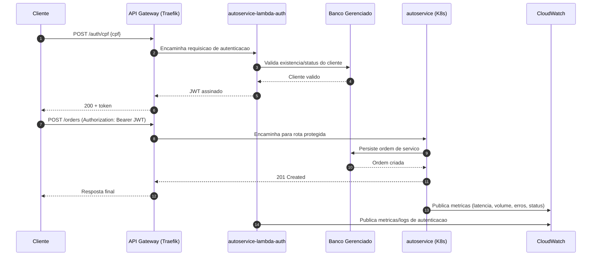

# Diagrama de Sequencia - Autenticacao e Abertura de Ordem

## Observacoes

- Este repositorio cobre infraestrutura K8s/gateway/observabilidade base.
- A validacao de CPF, emissao de JWT e regras de autorizacao sao implementadas nos repositorios `autoservice-lambda-auth` e `autoservice`.
